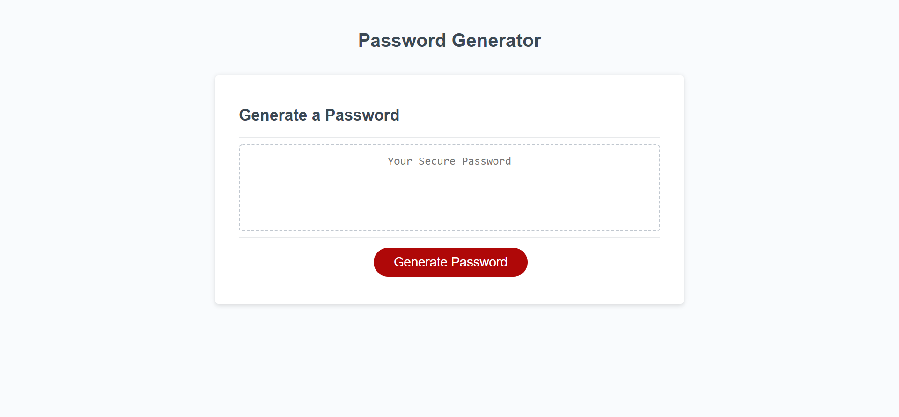
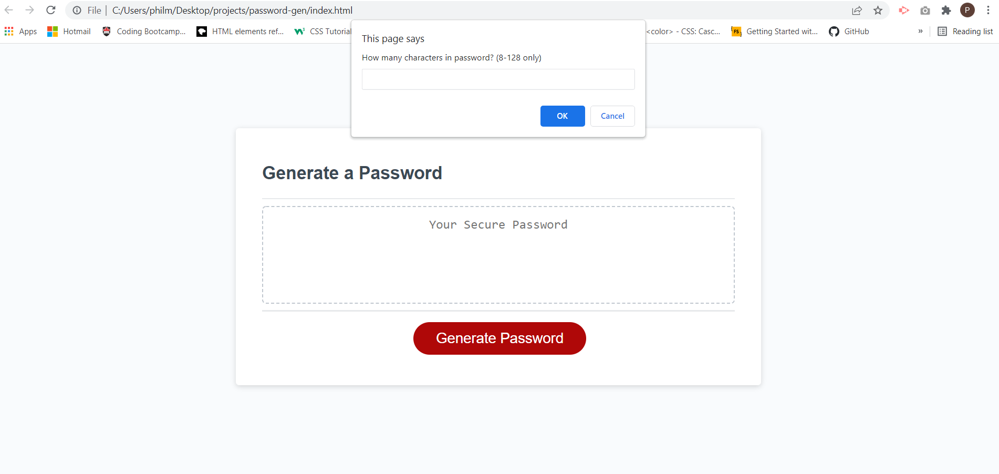
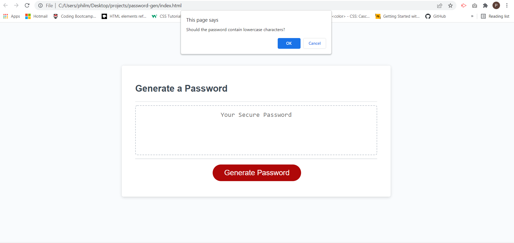
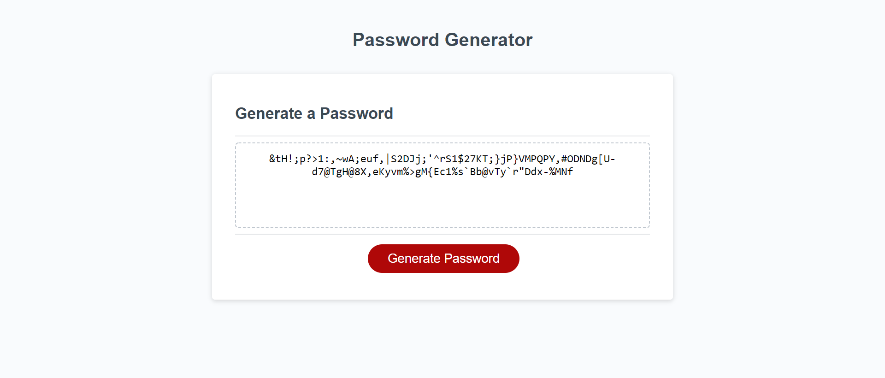

# Password Generator

## About This Project

This project is a webpage that generates a password based on the criteria chosen by the user. The HTML, CSS, and JavaScript files were provided, but the JavaScript had no real functionality, beyond a click button. I created the "generatePassword" function, which handles the user inputs for criteria, generates a password based on those criteria, and displays the password back to the user.

There were several key stages to creating this functionality:
* Adding prompts to request the parameters the user wants for the password - e.g. how long, what types of characters are to be used
* Ensuring that the inputs are valid and that at least one criteria has been chosen
* Taking those criteria and using Math.random within a for loop to randomly select the correct amount of random characters for the password
* Returning the password to the user

---
## Screenshots

Below are screenshots of the site at various stages of generating the password.

Upon clicking the "Generate Password" button, prompts will begin to ask the user questions

Examples of user inputs requesting criteria for the password

Outcome of the process where the user is presented with a randomly generated password

---
## Links
[Project Code on Github](https://github.com/philmcgarty/password-gen "Github")

[Deployed Site](https://philmcgarty.github.io/password-gen)